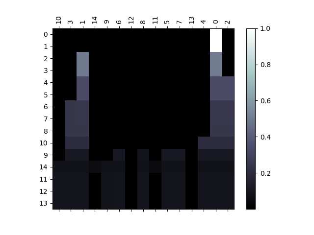
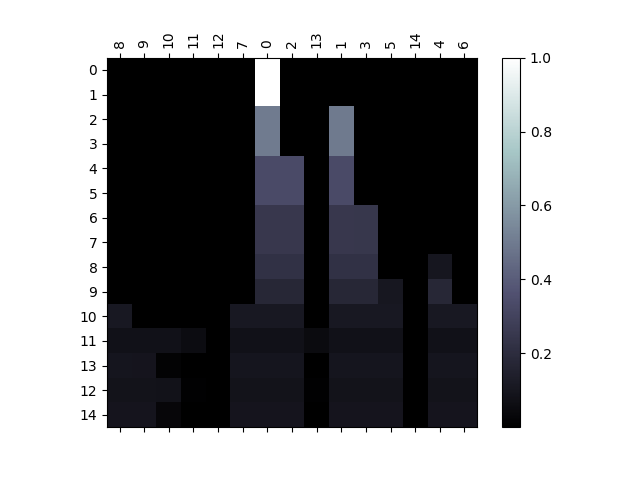
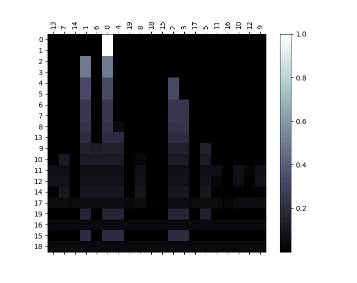
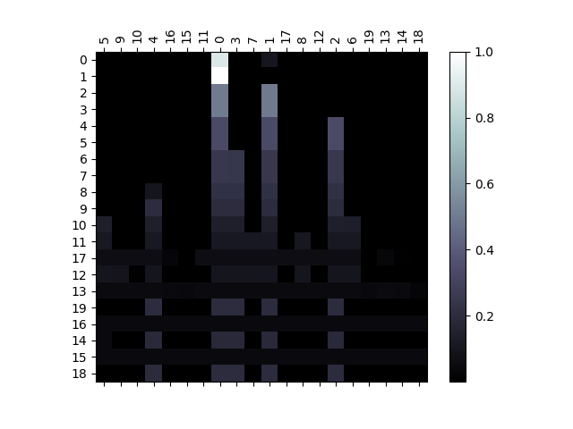

# neural-combinatorial-rl-pytorch

PyTorch implementation of [Neural Combinatorial Optimization with Reinforcement Learning](https://arxiv.org/abs/1611.09940). 

So far, I have implemented the basic RL pretraining model from the paper. An implementation of the supervised learning baseline model is available [here](https://github.com/pemami4911/neural-combinatorial-rl-tensorflow). 

My implementation uses a stochastic decoding policy in the pointer network, realized via PyTorch's `torch.multinomial()`, during training, and a greedy policy for decoding when testing the model. Other modifications I made include using dropout in the encoder of the pointer network and the critic network. A dropout value of `0.1` significantly improved the results. Otherwise, I used the same hyperparameters as mentioned in the paper. 

Currently, this implementation only supports a simple sorting task. You can train the model on any sorting task from `sort10` to `sort99` (sequences of length 10 and 99, respectively).

To run `sort10`:
    
    ./trainer.py --dropout 0.1 --random_seed 1234 --run_name sort10-dropout-0.1-seed-1234

To load a saved model trained on `sort10` and test on `sort15`:

    ./trainer.py --task sort15 --max_decoder_len 15 --load_path outputs/sort10/24601-dropout-0.1/epoch-3.pt --run_name 24601-sort15-epoch-3 --is_train False

To load a saved model and view the pointer network's attention layer:

    ./trainer.py --task sort15 --max_decoder_len 15 --load_path outputs/sort10/24601-dropout-0.1/epoch-3.pt --run_name 24601-sort15-attend --is_train False --disable_tensorboard True --plot_attention True

Please, feel free to notify me if you encounter any errors, or if you'd like to submit a pull request to add more features to this implementation.

## Adding other tasks

This work can be extended easily to support other tasks, such as the Travelling Salesman Problem. See the `sorting_task.py` module for a reference. The key thing is to provide a reward function that takes in a sample solution, selected by the pointer network from the input, and returns a scalar reward. For the sorting task, the agent received a reward proportional to the length of the longest strictly increasing subsequence in the decoded output (e.g., `[1, 3, 5, 2, 4] -> 3/5 = 0.6`).

## Dependencies

* Python=3.6 (should be OK with v >= 3.4)
* PyTorch=0.1.12_2
* tqdm
* matplotlib
* [tensorboard_logger](https://github.com/TeamHG-Memex/tensorboard_logger)

## Results

I trained a model on `sort10` for 4 epochs of 1,000,000 randomly generated samples. I tested it on a dataset of size 10,000. Then, I tested the same model on `sort15` and `sort20` to test the generalization capabilities.

Test results on 10,000 samples: 

| task | average reward | variance | 
|---|---|---|
| sort10 | 0.9966 | 0.0005 |
| sort15 | 0.7484 | 0.0177 |
| sort20 | 0.5586 | 0.0060 | 


Example prediction on `sort10`: 

```
input: [4, 7, 5, 0, 3, 2, 6, 8, 9, 1]
output: [0, 1, 2, 3, 4, 5, 6, 7, 8, 9]
```

### Attention visualization

Plot the pointer network's attention layer with the argument `--plot_attention True`

Examples: 

`sort10`: 


During greedy decoding, after making a selection, the logits for that index for the input is set to 0 for the rest of the decoding process.

`sort15`:





`sort20`:



Zoomed in slightly. Notice how the network doesn't really know how to handle higher numbers it wasn't trained on! But, it understands that they belong closer to the end of the output sequence.



## TODO

* [ ] Add RL pretraiing-Sampling
* [ ] Add RL pretraining-Active Search
* [ ] Active Search
* [ ] Asynchronous training a la A3C
* [ ] Refactor `USE_CUDA` variable

## Acknowledgements

Special thanks to the repos [devsisters/neural-combinatorial-rl-tensorflow](https://github.com/devsisters/neural-combinatorial-rl-tensorflow) and [MaximumEntropy/Seq2Seq-PyTorch](https://github.com/MaximumEntropy/Seq2Seq-PyTorch) for getting me started. 

